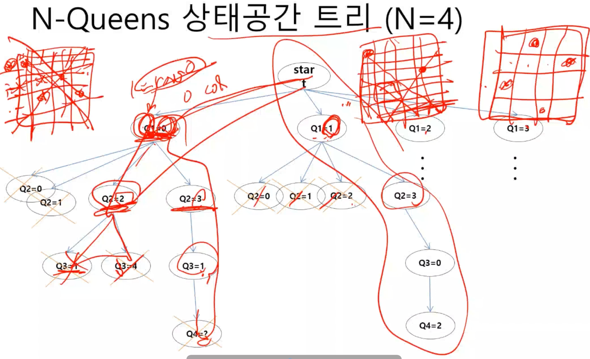
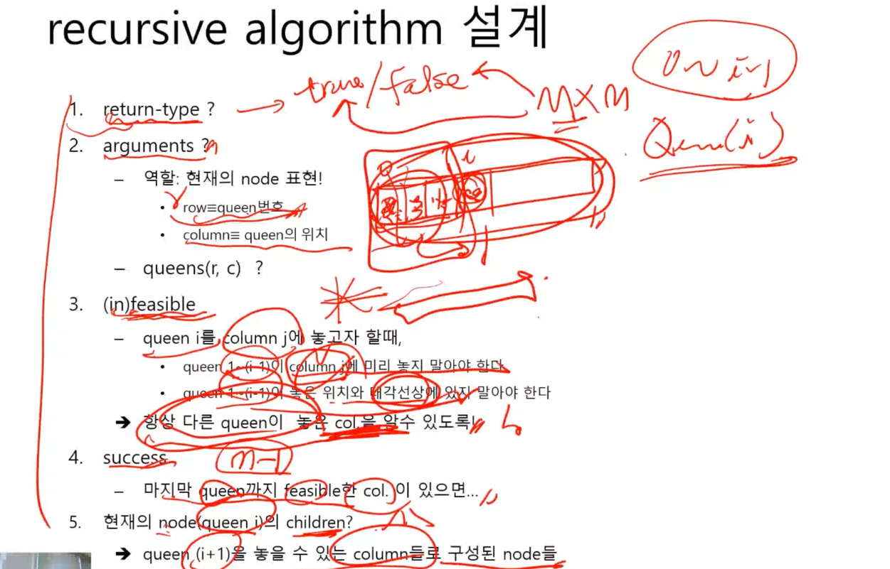

# 1. 카드셀렉션
- 그리디 알고리즘 속성이 아님.
- 이런 문제 유형은 '점화식' 이용

# 2. Permutation / Anagram
- 순열, 가질 수 있는 조합의 가짓수를 나열하는 문제
- n!

# 3. Parenthesis
- 정수 n이 주어졌을 때, 의미있는 괄호 조합 출력
- ( 는 n개 = openCount
- ) 는 ( 의 개수만큼 = closeCount
- total 개수 = 2n 이면 

# 4. N Queens
- N개의 퀸을 다른 퀸의 공격 범위에 속하지 않는 경우의 수 찾기
- 상태공간트리
- backtracking (depth first search & trial and error)

### 상태공간트리

### 알고리즘 설계
